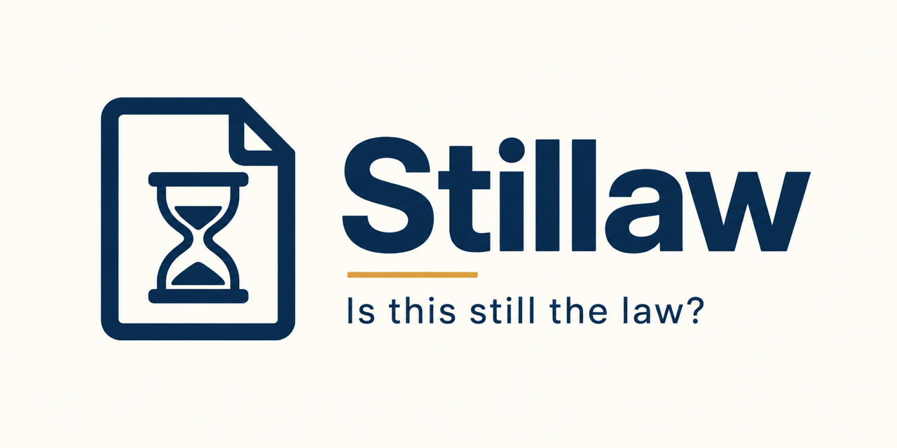

<p align="center">
  
</p>

<p align="center">
  <a href="https://pypi.org/project/stillaw/"></a>
  <a href="https://pypi.org/project/stillaw/"></a>
  <a href="LICENSE"></a>
  
  
</p>

<p align="center">
  <b>Is this still the law?</b><br>
  <a href="#install">Install</a> ·
  <a href="#command-line">Command line</a> ·
  <a href="#what-it-knows-and-what-it-doesnt">What it knows</a> ·
  <a href="#mcp">MCP</a> ·
  <a href="README.pl.md">🇵🇱 po polsku</a>
</p>

---

Give it a Polish statute (a Dziennik Ustaw citation, an ELI id, or a title) and a date, and
it tells you whether the consolidated text is still the law in force on that date, which
amendment changed it, from when, and **quotes the clause it read the date from**. No language
model anywhere in the loop: everything is resolved from the ELI API of the Dziennik Ustaw
(api.sejm.gov.pl), deterministically, with a sha256 of the answer.

> **Of 89 Polish consolidated statute texts checked on 2026-08-24, 57 were no longer the law
> in force.** A text can be wrong and still be the newest one published.

## Who this is for

- **Lawyers and in-house counsel** who need to know whether a text pulled from a database
  last quarter still governs, before it goes into a filing.
- **Anyone building a legal assistant.** A retrieval layer that returns the newest
  consolidated text is not the same as one that returns the law. This tells you which you have.
- **Compliance and policy teams** tracking what changes and from when, including amendments
  published but not yet in force.
- **Researchers** who need a date they can defend, with the clause it came from.

## Install

```
pip install stillaw
```

Python 3.11 or newer, standard library only. Two external binaries are used: `curl` as a
fallback when Python does not trust the API's certificate chain, and `pdftotext` (poppler)
to read amending acts, which the ELI serves as PDF only.

## Command line

```
stillaw check "Dz.U. 2024 poz. 1251" --as-of 2026-08-28
```

```
Dz.U. 2024 poz. 1251  Prawo o ruchu drogowym  (consolidated text published 2024-08-19)
status as of 2026-08-28: SUPERSEDED since 2025-07-25
superseded by: DU/2025/820  Ustawa z dnia 9 maja 2025 r. o zmianie ustawy o Służbie Więziennej oraz niektórych innych
amendments after the text: 7
  DU/2025/820    promulgated 2025-06-24  in force 2025-07-25  after 30 days
      Ustawa z dnia 9 maja 2025 r. o zmianie ustawy o Służbie Więziennej oraz niektórych innych ustaw
      basis: wchodzi w życie po upływie 30 dni od dnia ogłoszenia, z wyjątkiem art. 27, art. 28 i art. 30, które wchodzą w życie po upływie 14 dni od dnia ogłoszenia.
  DU/2025/1006   promulgated 2025-07-25  in force 2025-08-09  after 14 days
      Ustawa z dnia 25 czerwca 2025 r. o zmianie ustawy o informatyzacji działalności podmiotów realizując
      basis: wchodzi w życie po upływie 14 dni od dnia ogłoszenia, z wyjątkiem: 1) art. 3 pkt 2 lit. a i b oraz pkt 3, art. 4 pkt 2, 4 i 5 oraz art. 9, które wchodzą w życie
  [... five more amendments, each with its own clause ...]
record: https://api.sejm.gov.pl/eli/acts/DU/2024/1251
sha256: 37ff72320e8014d8932fbe9cd329be1fba39d1756fd41f25f0560ebf065acc49
```

The same with `--json` gives every field above as data: the amendment list with
`promulgated`, `in_force`, `basis` (the clause, verbatim), `how` (which rule resolved it),
`amending_article` (which article of the amending act touches this statute), the ELI's own
`eli_entry_into_force` for the act as a whole, a `disagreement` note when the two differ
without an exception explaining it, and links to the ELI record and PDF of every act.

A text with nothing after it:

```
stillaw check DU/2025/1691 --as-of 2026-08-28 --json
```

```json
{
 "stillaw": "0.1.0",
 "query": "DU/2025/1691",
 "as_of": "2026-08-28",
 "eli": "DU/2025/1691",
 "address": "Dz.U. 2025 poz. 1691",
 "title": "Obwieszczenie Marszałka Sejmu Rzeczypospolitej Polskiej z dnia 7 listopada 2025 r. w sprawie ogłoszenia jednolitego tekstu ustawy - Kodeks postępowania administracyjnego",
 "statute": "Kodeks postępowania administracyjnego",
 "text_published": "2025-12-03",
 "consolidated_text": true,
 "status": "current",
 "since": null,
 "superseded_by": null,
 "next_change": null,
 "amendments": [],
 "undetermined": [],
 "resolution": [],
 "links": {
  "record": "https://api.sejm.gov.pl/eli/acts/DU/2025/1691",
  "text_pdf": "https://api.sejm.gov.pl/eli/acts/DU/2025/1691/text.pdf"
 },
 "sha256": "b56e33a17e763a3f4ad4bf987f607b71de70184094bb6dd652248ad13cade14d"
}
```

Accepted references: `Dz.U. 2024 poz. 1251`, `Dz. U. z 2024 r. poz. 1251`, `DU/2024/1251`,
or a title such as `Kodeks pracy` (the newest consolidated text is looked up). A citation of
the original act is redirected to its newest consolidated text.

`stillaw survey` runs the check over a built-in list of 89 statutes a business or
technology lawyer opens. It makes several hundred requests; use it deliberately.

## Python

```python
from stillaw import pl
result = pl.check("Dz.U. 2024 poz. 1251", as_of="2026-08-28")
result["status"], result["since"], result["superseded_by"]["eli"]
```

## MCP

```
pip install "stillaw[mcp]"
python -m stillaw.mcp_server
```

One tool, `stillaw_check(reference, as_of=None)`, returning the same dict as the CLI's
`--json`. Claude Desktop configuration:

```json
{"mcpServers": {"stillaw": {"command": "python", "args": ["-m", "stillaw.mcp_server"]}}}
```

## What it knows and what it doesn't

The status is one of four, and the fourth is the honest one:

- `current`: no amendment was promulgated after the consolidated text.
- `superseded`: at least one amendment is already in force on the as-of date.
- `vacatio_legis`: amendments exist, none is in force yet. The text is still the law.
- `undetermined`: an amendment exists whose date could not be established. This is never
  reported as `current`, because the text may already be superseded and we simply do not
  know. A human reads that act; its id is listed under `undetermined`.

What it reads: the final article of each amending act ("Ustawa wchodzi w życie ..."),
including exception groups that defer whole articles or chapters of the amending act to
another date. It knows which article of the amending act touches your statute, so the
date it reports is the one for your statute, not for the act as a whole. The ELI's own
`entryIntoForce` field is fetched alongside as an independent control.

What it does not do:

- It works at the level of the act, not the provision. An exception that defers a single
  point of an article ("art. 1 pkt 9") is recorded as `partial_exception`, but the status
  follows the base date. Whether the specific paragraph you care about has changed is a
  question this version does not answer.
- A clause it does not recognise is not guessed. Dates set by another act ("z dniem
  wejścia w życie ustawy o ..."), by regulation, or by a Constitutional Court judgment are
  reported as undetermined, with the ELI date used where the ELI has one.
- It covers the Dziennik Ustaw (statutes and regulations). Monitor Polski, EU law and
  local law are out of scope.
- It says nothing about whether the amendment matters. A one-word change and a rewrite
  both make the text superseded.
- Readers for legislation.gov.uk (`stillaw.uk`) and boe.es (`stillaw.es`) exist as
  library functions for comparison. Both jurisdictions publish the in-force data the
  Polish parser has to reconstruct from prose. They are not wired into the CLI yet.

## Design

Icon and banner live in `assets/`. The mark is a document with an hourglass inside it: the
question is about a text and about time, not about a court, so there is no gavel and no scales.

| role | colour | where |
|---|---|---|
| background | `#F6F5F1` | pages, cards, large areas |
| ink | `#102A43` | body text, headings, the mark |
| warning | `#C58A1C` | superseded status, badges, borders |

The warning colour is deliberately amber rather than red: terminal red already means failure,
and a superseded statute is not a failure, it is a fact that needs checking. For a status badge,
`#FFF6DA` background with `#9A6812` text and border.

Type: **IBM Plex Sans** for headings and prose, **JetBrains Mono** for code and CLI output.
Both under the SIL Open Font License.

## Contributing

Bug reports about a statute whose status comes out wrong are the most useful thing you can
send: paste the citation, the date and what you expected. The parser is built from clauses
seen in the wild, so every clause it does not recognise is a real gap.

If Stillaw saved you one wrong citation, leave a ⭐. Stars are what puts a tool in front of
the next person who needs it.

## License

MIT. Copyright 2026 Paweł Kwaczyński.
